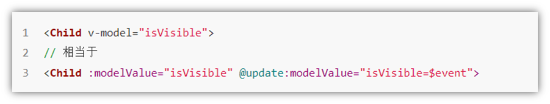
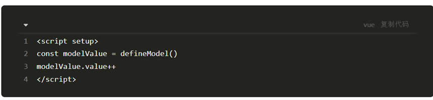

# 认识Vue3
## 1. Vue2 选项式 API vs Vue3 组合式API

```vue
<script>
export default {
  data(){
    return {
      count:0
    }
  },
  methods:{
    addCount(){
      this.count++
    }
  }
}
</script>
```

```vue
<script setup>
import { ref } from 'vue'
const count = ref(0)
const addCount = ()=> count.value++
</script>
```

特点：

1. 代码量变少
2. 分散式维护变成集中式维护
## 2. Vue3的优势


# 使用create-vue搭建Vue3项目
## 1. 认识create-vue
> create-vue是Vue官方新的脚手架工具，底层切换到了 vite （下一代前端工具链），为开发提供极速响应


## 2. 使用create-vue创建项目
> 前置条件 - 已安装16.0或更高版本的Node.js

执行如下命令，这一指令将会安装并执行 create-vue
```bash
npm init vue@latest
```


# 熟悉项目和关键文件


# 组合式API - setup选项
## 1. setup选项的写法和执行时机
写法
```vue
<script>
  export default {
    setup(){
      
    },
    beforeCreate(){
      
    }
  }
</script>
```
执行时机
> 在beforeCreate钩子之前执行


## 2. setup中写代码的特点
> 在setup函数中写的数据和方法需要在末尾以对象的方式return，才能给模版使用

```vue
<script>
  export default {
    setup(){
      const message = 'this is message'
      const logMessage = ()=>{
        console.log(message)
      }
      // 必须return才可以
      return {
        message,
        logMessage
      }
    }
  }
</script>
```
## 3. setup语法糖
> script标签添加 setup标记，不需要再写导出语句，默认会添加导出语句

```vue
<script setup>
  const message = 'this is message'
  const logMessage = ()=>{
    console.log(message)
  }
</scrip>
```

# 组合式API - reactive和ref函数
## 1. reactive
> 接受对象类型数据的参数传入并返回一个响应式的对象


```vue
<script setup>
 // 导入
 import { reactive } from 'vue'
 // 执行函数 传入参数 变量接收
 const state = reactive({
   msg:'this is msg'
 })
 const setSate = ()=>{
   // 修改数据更新视图
   state.msg = 'this is new msg'
 }
</script>

<template>
  {{ state.msg }}
  <button @click="setState">change msg</button>
</template>
```

## 2. ref
> 接收简单类型或者对象类型的数据传入并返回一个响应式的对象

```vue
<script setup>
 // 导入
 import { ref } from 'vue'
 // 执行函数 传入参数 变量接收
 const count = ref(0)
 const setCount = ()=>{
   // 修改数据更新视图必须加上.value
   count.value++
 }
</script>

<template>
  <button @click="setCount">{{count}}</button>
</template>
```
## 3. reactive 对比 ref

1. 都是用来生成响应式数据
2. 不同点
   1. reactive不能处理简单类型的数据
   2. ref参数类型支持更好，但是必须通过.value做访问修改
   3. ref函数内部的实现依赖于reactive函数
3. 在实际工作中的推荐
   1. 推荐使用ref函数，减少记忆负担
# 组合式API - computed
> 计算属性基本思想和Vue2保持一致，组合式API下的计算属性只是修改了API写法

- 与 Vue2.x 中 computed 配置功能一致

- 写法

  ```js
  import {computed} from 'vue'

  setup(){
      ...
      //计算属性——简写
      let fullName = computed(()=>{
          return person.firstName + '-' + person.lastName
      })
      //计算属性——完整
      let fullName = computed({
          get(){
              return person.firstName + '-' + person.lastName
          },
          set(value){
              const nameArr = value.split('-')
              person.firstName = nameArr[0]
              person.lastName = nameArr[1]
          }
      })
  }
  ```
# 组合式API - watch
- 与 Vue2.x 中 watch 配置功能一致

- 两个小“坑”：

  - 监视 reactive 定义的响应式数据时：oldValue 无法正确获取、强制开启了深度监视（deep 配置失效）。
  - 监视 reactive 定义的响应式数据中某个属性时：deep 配置有效。

  ```js
  //情况一：监视ref定义的响应式数据
  watch(
    sum,
    (newValue, oldValue) => {
      console.log('sum变化了', newValue, oldValue)
    },
    { immediate: true }
  )

  //情况二：监视多个ref定义的响应式数据
  watch([sum, msg], (newValue, oldValue) => {
    console.log('sum或msg变化了', newValue, oldValue)
  })

  /* 情况三：监视定reactive义的响应式数据
              若watch监视的是reactive定义的响应式数据，则无法正确获得oldValue！！
              若watch监视的是reactive定义的响应式数据，则强制开启了深度监视 
  */
  watch(
    person,
    (newValue, oldValue) => {
      console.log('person变化了', newValue, oldValue)
    },
    { immediate: true, deep: false }
  ) //此处的deep配置不再奏效

  //情况四：监视reactive定义的响应式数据中的某个属性
  watch(
    () => person.name,
    (newValue, oldValue) => {
      console.log('person的name变化了', newValue, oldValue)
    }
  )

  //情况五：监视reactive定义的响应式数据中的某些属性
  watch([() => person.age, () => person.name], (newValue, oldValue) => {
    console.log('person的age/name变化了', newValue, oldValue)
  })

  //特殊情况 监视的reactive定义的某个属性依然是一个对象，deep有效
  watch(
    () => person.job,
    (newValue, oldValue) => {
      console.log('person的job变化了', newValue, oldValue)
    },
    { deep: true }
  ) //此处由于监视的是reactive素定义的对象中的某个属性，所以deep配置有效
  ```


# 组合式API - 生命周期函数
## 1. 选项式对比组合式

## 2. 生命周期函数基本使用
> 1. 导入生命周期函数
> 2. 执行生命周期函数，传入回调

```vue
<scirpt setup>
import { onMounted } from 'vue'
onMounted(()=>{
  // 自定义逻辑
})
</script>
```
## 3. 执行多次
> 生命周期函数执行多次的时候，会按照顺序依次执行

```vue
<scirpt setup>
import { onMounted } from 'vue'
onMounted(()=>{
  // 自定义逻辑
})

onMounted(()=>{
  // 自定义逻辑
})
</script>
```
# 组合式API - 父子通信
## 1. 父传子
> 基本思想
> 1. 父组件中给子组件绑定属性
> 2. 子组件内部通过props选项接收数据


## 2. 子传父
> 基本思想
> 1. 父组件中给子组件标签通过@绑定事件
> 2. 子组件内部通过 emit 方法触发事件


# 组合式API - 模版引用
> 概念：通过 ref标识 获取真实的 dom对象或者组件实例对象

## 1. 基本使用
> 实现步骤：
> 1. 调用ref函数生成一个ref对象
> 2. 通过ref标识绑定ref对象到标签


## 2. defineExpose
> 默认情况下在 setup语法糖下组件内部的属性和方法是不开放给父组件访问的，可以通过defineExpose编译宏指定哪些属性和方法容许访问
> 说明：指定testMessage属性可以被访问到


# 组合式API - provide和inject
## 1. 作用和场景
> 顶层组件向任意的底层组件传递数据和方法，实现跨层组件通信


## 2. 跨层传递普通数据
> 实现步骤
> 1. 顶层组件通过 `provide` 函数提供数据
> 2. 底层组件通过 `inject` 函数提供数据


## 3. 跨层传递响应式数据
> 在调用provide函数时，第二个参数设置为ref对象


## 4. 跨层传递方法
> 顶层组件可以向底层组件传递方法，底层组件调用方法修改顶层组件的数据


# Vue3.3 新特性-defineOptions

背景说明：

有 script setup 之前，如果要定义 props, emits 可以轻而易举地添加一个与 setup 平级的属性。 

但是用了 script setup 后，就没法这么干了 setup 属性已经没有了，自然无法添加与其平级的属性。

---

为了解决这一问题，引入了 defineProps 与 defineEmits 这两个宏。但这只解决了 props 与 emits 这两个属性。

如果我们要定义组件的 name 或其他自定义的属性，还是得回到最原始的用法——再添加一个普通的 script 标签。

这样就会存在两个 script 标签。让人无法接受。

---

所以在 Vue 3.3 中新引入了 defineOptions 宏。顾名思义，主要是用来定义 Options API 的选项。可以用 defineOptions 定义任意的选项， props, emits, expose, slots 除外（因为这些可以使用 defineXXX 来做到）


# Vue3.3新特性-defineModel

在Vue3中，自定义组件上使用v-model, 相当于传递一个modelValue属性，同时触发 update:modelValue 事件



我们需要先定义 props，再定义 emits 。其中有许多重复的代码。如果需要修改此值，还需要手动调用 emit 函数。

于是乎 defineModel 诞生了。




生效需要配置 vite.config.js

```jsx
import { fileURLToPath, URL } from 'node:url'

import { defineConfig } from 'vite'
import vue from '@vitejs/plugin-vue'

// https://vitejs.dev/config/
export default defineConfig({
  plugins: [
    vue({
      script: {
        defineModel: true
      }
    }),
  ],
  resolve: {
    alias: {
      '@': fileURLToPath(new URL('./src', import.meta.url))
    }
  }
})
```

